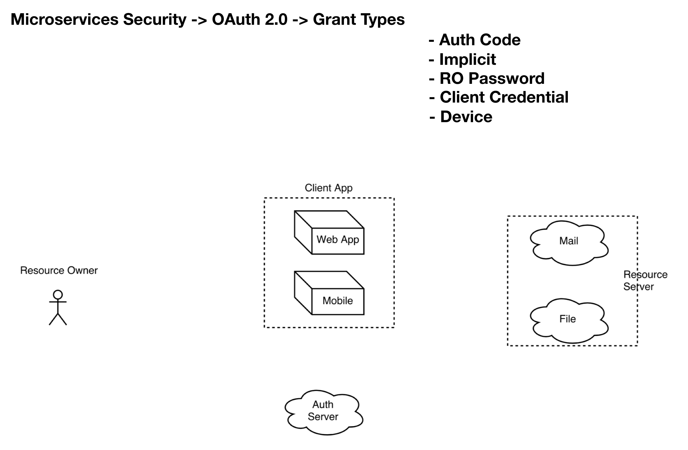
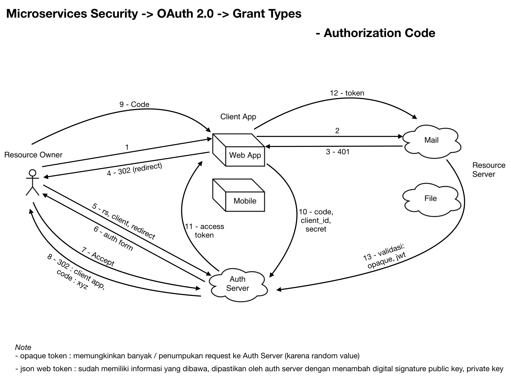

# Spring OAUTH2 #

Roadmap

* Overview Spring Oauth2 
* Build from scratch
* Live Demo

## Spring Oauth2 ##

* Spring OAuth 2.0 sebenarnya adalah untuk Authorization --> berkaitan dengan permission atau ijin akses/role/privileges
* Mengijinkan aplikasi pihak ketiga untuk mendapatkan akses terbatas ke HTTP service
* Satu login untuk banyak aplikasi, contoh : Google, Facebook, Instagram, Twitter, etc
* Terdapat mekanisme login tidak terlalu diatur --> untuk mengatur login biasanya disediakan protokol lain misal : openId

## Entity / Terminology ##



* Resource Owner (RO) --> yang memiliki data
* Resource Server (RS) --> aplikasi tempat data dari RO disimpan
* Client App --> aplikasi lain yang akan memakai data yang tersimpan pada RS
* Client App bisa di bangun oleh pihak yang sama dengan RS, contoh : google email dengan client app gmail pada mobile
* Client App juga bisa menggunakan third party apps, contoh : login pada instagram bisa dishare ke facebook atas nama RO
* Mekanisme yg memastikan client app memiliki akses kontrol / aplikasi yang diijinkan oleh RO sesuai data RO --> Authorization Server 

## Mode (Grant Type) of Auth Server ##

Protokol OAuth memiliki beberapa Mode :

* Authorization Code
* Implicit
* Resource Owner Password
* Client Credential
* Device

### Authorization Code ###

* Applikasi web yang dapat menyimpan client key (secret/password)
* Resource Owner tidak pernah memberikan password ke client app
* Selalu berkaitan dengan Resoure Owner
* Flow sebagai berikut



### Implicit ###

* Tidak menyimpan client key
* Resource Owner tidak pernah memberikan password ke client app
* Selalu berkaitan dengan Resoure Owner

### Resource Owner Password ###

* Client app dan resource server didevelop oleh pihak yang sama, contoh : facebook membuat client app sendiri (facebook mobile) disimpan di server karena sama-sama di develop oleh perusahaan facebook
* Client app dapat langsung menerima client credential (username & password) dari Resource Owner --> ContentType : RO & Password
* Selalu berkaitan dengan Resoure Owner

### Client Credential ###

* Client app tidak spesifik terhadap user data tertentu, contoh : treading topik pada twitter
* Hanya antara Client app dengan Resource Server

### Device ###

* Fitur terbaru --> kamera yang sudah terkoneksi dengan cloud service
* Input terbatas (misal tidak bisa buka browser / auth form)
* Menyediakan suatu kode unik saat ingin akses via browser

## Build and Run ##

### Spring Boot Initializr ###

1. Create Zipkin Server --> Browse [https://start.spring.io/] (https://start.spring.io/)

2. Fill Project Metadata

    Group
    
    ```
    com.sheringsession.balicamp.zipkin    
    ```

    Artifact
    
    ```
    zipkin-sleuth
    ```
   
    Dependencies
    
    ```
    Zipkin UI, Eureka Discovery, Config Client
    ```
   
3. Generate Project

4. Download dan import to your IDE


### Build with Maven ###

1. In `pom.xml` makesure for dependency
    
    ```
    <dependency>
        <groupId>org.springframework.cloud</groupId>
        <artifactId>spring-cloud-starter-config</artifactId>
    </dependency>
    <dependency>
        <groupId>org.springframework.cloud</groupId>
        <artifactId>spring-cloud-starter-eureka</artifactId>
    </dependency>
    <dependency>
        <groupId>io.zipkin.java</groupId>
        <artifactId>zipkin-server</artifactId>
    </dependency>
    <dependency>
        <groupId>io.zipkin.java</groupId>
        <artifactId>zipkin-autoconfigure-ui</artifactId>
        <scope>runtime</scope>
    </dependency>
    ```

2. `applicatioin.properties` rename into `bootstrap.yml`

    ```
    spring:
      application:
        name: zipkin
      cloud:
        config:
          discovery:
            enabled: true
            service-id: configservice
          fail-fast: true

    ---
    spring:
      profiles: native
    server:
      port: 8898
    eureka:
      instance:
        hostname: localhost:8898
      client:
          serviceUrl:
            defaultZone: http://localhost:8761/eureka/,http://localhost:8762/eureka/
    ```

### Build with IDE ###

3. Add `@EnableZipkinServer` into your spring project configuration

    ```
    @SpringBootApplication
    @EnableZipkinServer
    public class ZipkinApplication {

        public static void main(String[] args) {
            SpringApplication.run(ZipkinApplication.class, args);
        }
    }
    ```

### Configure In Microservice (Client) ###

1. In `pom.xml` add new dependency
    
    ```
    <dependency>
        <groupId>org.springframework.cloud</groupId>
        <artifactId>spring-cloud-sleuth-zipkin</artifactId>
    </dependency>
    <dependency>
        <groupId>org.springframework.cloud</groupId>
        <artifactId>spring-cloud-starter-sleuth</artifactId>
    </dependency>
    ```

2. In `bootstrap.yml` add new properties

    ```
    spring:
        ...
        zipkin:
            base-url: http://localhost:8765 #or your zipkin server uri
        sleuth:
            sampler:
              percentage: 1.0
    ```

3. You will see something like this in the logging, ex: browse from catalog service

    ```
    2017-10-30 17:45:00.923  INFO [catalog,4a10e06c3fe40f0f,4a10e06c3fe40f0f,false] 2829 --- [nio-8764-exec-1] i.t.t.m.c.c.ProductApiController         : ##### Mengambil data semua produk
    ```

In the example, `catalog` is the `spring.application.name`, `4a10e06c3fe40f0f` is the trace ID and `4a10e06c3fe40f0f` is the span ID.

### FINISH ###