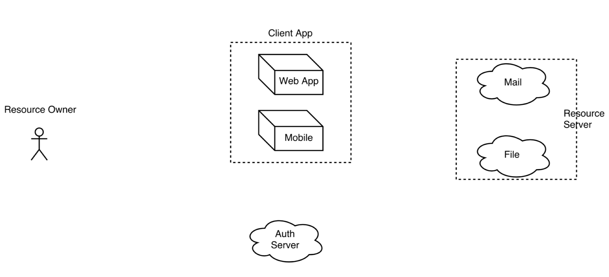

# Spring OAuth 2.0 #

Roadmap

* Overview Spring Oauth2
* Build from scratch
* Live Demo

## Spring Oauth 2.0 ##

* Spring OAuth 2.0 sebenarnya adalah untuk Authorization --> berkaitan dengan permission atau ijin akses/role/privileges
* Mengijinkan aplikasi pihak ketiga untuk mendapatkan akses terbatas ke HTTP service
* Satu login untuk banyak aplikasi, contoh : Google, Facebook, Instagram, Twitter, etc
* Terdapat mekanisme login tidak terlalu diatur --> untuk mengatur login biasanya disediakan protokol lain misal : openId

## Entity / Terminology ##



* Resource Owner (RO) --> yang memiliki data
* Resource Server (RS) --> aplikasi tempat data dari RO disimpan
* Client App --> aplikasi lain yang akan memakai data yang tersimpan pada RS
* Client App bisa di bangun oleh pihak yang sama dengan RS, contoh : google email dengan client app gmail pada mobile
* Client App juga bisa menggunakan third party apps, contoh : login pada instagram bisa dishare ke facebook atas nama RO
* Mekanisme yg memastikan client app memiliki akses kontrol / aplikasi yang diijinkan oleh RO sesuai data RO --> Authorization Server

## Mode (Grant Type) of Auth Server ##

Protokol OAuth memiliki beberapa Mode :

* Authorization Code
* Implicit
* Resource Owner Password
* Client Credential
* Device

### Authorization Code ###

* Applikasi web yang dapat menyimpan client key (secret/password)
* Resource Owner tidak pernah memberikan password ke client app
* Selalu berkaitan dengan Resoure Owner
* Flow sebagai berikut


### Implicit ###

* Tidak menyimpan client key
* Resource Owner tidak pernah memberikan password ke client app
* Selalu berkaitan dengan Resoure Owner
* Flow sebagai berikut


### Resource Owner Password ###

* Client app dan resource server didevelop oleh pihak yang sama, contoh : facebook membuat client app sendiri (facebook mobile) disimpan di server karena sama-sama di develop oleh perusahaan facebook
* Client app dapat langsung menerima client credential (username & password) dari Resource Owner --> ContentType : RO & Password
* Selalu berkaitan dengan Resoure Owner
* Flow sebagai berikut


### Client Credential ###

* Client app tidak spesifik terhadap user data tertentu, contoh : treading topik pada twitter
* Hanya antara Client app dengan Resource Server
* Flow sebagai berikut


### Device ###

* Fitur terbaru --> kamera yang sudah terkoneksi dengan cloud service
* Input terbatas (misal tidak bisa buka browser / auth form)
* Menyediakan suatu kode unik saat ingin akses via browser
* Biasanya menggunakan metode pooling, karena berjalannya di belakang firewall/proxy dan auth server tidak bisa komunikasi via ip public
* Flow sebagai berikut


Referensi : [OAuth 2.0 Device Grant Flow] (https://alexbilbie.com/2016/04/oauth-2-device-flow-grant/)


## Build and Run ##

### Spring Boot Initializr ###

1. Buat project baru --> Browse [https://start.spring.io/] (https://start.spring.io/)

2. Lengkapi Project Metadata

    Group

    ```java
    com.sharingsession.balicamp.springsecurity    
    ```

    Artifact

    ```java
    account
    ```

    Dependencies

    ```java
    Eureka Discovery, Config Client, Web, Security, Flyway, MySQL, JDBC
    ```

3. Generate Project

4. Download dan import pada IDE masing-masing

Dokumentasi mengenai flywaydb dapat dilihat pada tautan berikut : [Flywaydb Doc] (https://flywaydb.org/)

### Build dengan Maven ###

1. Pada `pom.xml` pastikan dependency berikut

    ```java
    <dependency>
        <groupId>org.springframework.cloud</groupId>
        <artifactId>spring-cloud-starter-config</artifactId>
    </dependency>
    <dependency>
        <groupId>org.springframework.cloud</groupId>
        <artifactId>spring-cloud-starter-eureka</artifactId>
    </dependency>
    <dependency>
        <groupId>org.springframework.cloud</groupId>
        <artifactId>spring-cloud-starter-oauth2</artifactId>
    </dependency>
    <dependency>
        <groupId>org.flywaydb</groupId>
        <artifactId>flyway-core</artifactId>
    </dependency>
    <dependency>
        <groupId>org.springframework.boot</groupId>
        <artifactId>spring-boot-starter-security</artifactId>
    </dependency>
    <dependency>
        <groupId>org.springframework.boot</groupId>
        <artifactId>spring-boot-starter-jdbc</artifactId>
    </dependency>
    <dependency>
        <groupId>org.springframework.boot</groupId>
        <artifactId>spring-boot-starter-web</artifactId>
    </dependency>
    <dependency>
        <groupId>mysql</groupId>
        <artifactId>mysql-connector-java</artifactId>
        <scope>runtime</scope>
    </dependency>
    ```

2. `applicatioin.properties` rename menjadi `bootstrap.yml` dan sesuaikan konfigurasinya

    ```java
    server:
      port: 8899
    spring:
      application:
        name: account
      datasource:
        url: jdbc:mysql://localhost/spring_oauth2
        username: root
        password: admin123
        driver-class-name: com.mysql.jdbc.Driver
      jpa:
        hibernate:
          ddl-auto: update
        show-sql: true
        properties:
          hibernate:
            format_sql: true
      cloud:
        config:
          discovery:
            enabled: true
            service-id: configservice
          fail-fast: true

    ---
    spring:
       profiles: native
    eureka:
      instance:
        hostname: localhost:8899
      client:
        serviceUrl:
          defaultZone: http://localhost:8761/eureka/,http://localhost:8762/eureka/
    ```


### Build dengan IDE ###

Tambahkan folder db/migration pada source package src/main/resources dan buat beberapa script PLSQL sesuai ketentuan konvension name flyaway data migration, contoh dari schema spring oauth2 dapat dilihat pada tautan : [Spring Oauth2 Schema] (https://github.com/spring-projects/spring-security-oauth/blob/master/spring-security-oauth2/src/test/resources/schema.sql)

* V2017110301__Skema_Security.sql

    ```sql
    CREATE TABLE s_permission (
      id               VARCHAR(255) NOT NULL,
      permission_label VARCHAR(255) NOT NULL,
      permission_value VARCHAR(255) NOT NULL,
      PRIMARY KEY (id),
      UNIQUE (permission_value)
    );

    CREATE TABLE s_role (
      id          VARCHAR(255) NOT NULL,
      description VARCHAR(255) DEFAULT NULL,
      name        VARCHAR(255) NOT NULL,
      PRIMARY KEY (id),
      UNIQUE (name)
    );

    CREATE TABLE s_role_permission (
      id_role       VARCHAR(255) NOT NULL,
      id_permission VARCHAR(255) NOT NULL,
      PRIMARY KEY (id_role, id_permission),
      FOREIGN KEY (id_permission) REFERENCES s_permission (id),
      FOREIGN KEY (id_role) REFERENCES s_role (id)
    );

    CREATE TABLE s_user (
      id       VARCHAR(36),
      username VARCHAR(255) NOT NULL,
      active   BOOLEAN      NOT NULL,
      id_role  VARCHAR(255) NOT NULL,
      PRIMARY KEY (id),
      UNIQUE (username),
      FOREIGN KEY (id_role) REFERENCES s_role (id)
    );


    CREATE TABLE s_user_password (
      id_user VARCHAR(36) NOT NULL,
      password VARCHAR(255) NOT NULL,
      PRIMARY KEY (id_user),
      FOREIGN KEY (id_user) REFERENCES s_user (id)
    );
    ```

* V2017110302__Skema_OAuth.sql

    ```sql
    create table oauth_client_details (
      client_id VARCHAR(255) PRIMARY KEY,
      resource_ids VARCHAR(255),
      client_secret VARCHAR(255),
      scope VARCHAR(255),
      authorized_grant_types VARCHAR(255),
      web_server_redirect_uri VARCHAR(255),
      authorities VARCHAR(255),
      access_token_validity INTEGER,
      refresh_token_validity INTEGER,
      additional_information VARCHAR(4096),
      autoapprove VARCHAR(255)
    );

    create table oauth_client_token (
      token_id VARCHAR(255),
      token BLOB,
      authentication_id VARCHAR(255) PRIMARY KEY,
      user_name VARCHAR(255),
      client_id VARCHAR(255)
    );

    create table oauth_access_token (
      token_id VARCHAR(255),
      token BLOB,
      authentication_id VARCHAR(255) PRIMARY KEY,
      user_name VARCHAR(255),
      client_id VARCHAR(255),
      authentication BLOB,
      refresh_token VARCHAR(255)
    );

    create table oauth_refresh_token (
      token_id VARCHAR(255),
      token BLOB,
      authentication BLOB
    );

    create table oauth_code (
      code VARCHAR(255), authentication BLOB
    );

    create table oauth_approvals (
      userId VARCHAR(255),
      clientId VARCHAR(255),
      scope VARCHAR(255),
      status VARCHAR(10),
      expiresAt TIMESTAMP DEFAULT  CURRENT_TIMESTAMP,
      lastModifiedAt TIMESTAMP DEFAULT  CURRENT_TIMESTAMP
    );
    ```

* V2017110303__Data_Security.sql

    ```sql
    INSERT INTO s_permission (id, permission_label, permission_value) VALUES
      ('configuresystem', 'CONFIGURE_SYSTEM', 'Configure System'),
      ('editproduct', 'EDIT_PRODUCT', 'Edit Product'),
      ('viewproduct', 'VIEW_PRODUCT', 'View Product');

    INSERT INTO s_role (id, description, name) VALUES
      ('superuser', 'SUPERUSER', 'Super User'),
      ('staff', 'STAFF', 'Staff'),
      ('manager', 'MANAGER', 'Manager');

    INSERT INTO s_role_permission (id_role, id_permission) VALUES
      ('staff', 'viewproduct'),
      ('manager', 'viewproduct'),
      ('manager', 'editproduct'),
      ('superuser', 'viewproduct'),
      ('superuser', 'editproduct'),
      ('superuser', 'configuresystem');

    INSERT INTO s_user (id, active, username, id_role) VALUES
      ('staff', true,'staff', 'staff');

    INSERT INTO s_user_password (id_user, password) VALUES
      -- password : balicamp123 menggunakan BCryptPasswordEncoder
      ('staff', '$2a$10$mWAbi9UrOGaYK8mWNexZ7OfNM8BBaoO.eLGAn/PYnRyXdm/HHt8AW');
    ```

    Untuk encrypt string password menggunakan metode BCryptPasswordEncoder dapat menggunakan tools online [bcrypt-generator] (https://bcrypt-generator.com)

* V2017110304__Data_OAuth.sql

    ```sql
    INSERT INTO oauth_client_details (client_id, resource_ids, client_secret, scope, authorized_grant_types, web_server_redirect_uri, authorities, access_token_validity, refresh_token_validity, additional_information, autoapprove) VALUES
    ('implicitclient', 'marketplace', '$2a$10$mWAbi9UrOGaYK8mWNexZ7OfNM8BBaoO.eLGAn/PYnRyXdm/HHt8AW', 'demo', 'password', 'http://example.com', 'APLIKASI_CLIENT_OAUTH2', 1800, 18000, '{}', 'demo');

    -- secret : userpassword001
    INSERT INTO oauth_client_details (client_id, resource_ids, client_secret, scope, authorized_grant_types, web_server_redirect_uri, authorities, access_token_validity, refresh_token_validity, additional_information, autoapprove) VALUES
    ('userpassword', 'marketplace', '$2a$10$Ooz4dGCLqrjyDViXrsCWEuvdsUSw6KyWN6Z5RvwXAr.Sujkhx3ouG', 'demo', 'password', 'http://example.com', 'APLIKASI_CLIENT_OAUTH2', 1800, 18000, '{}', 'demo');

    -- secret : authcode321
    INSERT INTO oauth_client_details (client_id, resource_ids, client_secret, scope, authorized_grant_types, web_server_redirect_uri, authorities, access_token_validity, refresh_token_validity, additional_information, autoapprove) VALUES
    ('authcodeclient', 'marketplace', '$2a$10$RF2g3Q299hwYKT2fHqa7sORgi86FK5fdVtLSr7Ult9arTSfhcLf6O', 'demo', 'authorization_code,refresh_token', 'http://example.com', 'APLIKASI_CLIENT_OAUTH2', 300, 3000, '{}', '');

    -- secret : clientapp999
    INSERT INTO oauth_client_details (client_id, resource_ids, client_secret, scope, authorized_grant_types, web_server_redirect_uri, authorities, access_token_validity, refresh_token_validity, additional_information, autoapprove) VALUES
    ('clientapp', 'marketplace', '$2a$10$tHHn7lRIEEIj4S/cdo8IjukTgKImCUlZceNOeyxqCr51sITqr3AYG', 'demo', 'client_credentials', 'http://example.com', 'APLIKASI_CLIENT_OAUTH2', NULL, NULL, '{}', 'demo');

    ```


Tambahkan annotation `@EnableDiscoveryClient` pada main class spring project configuration

```java
@SpringBootApplication
@EnableDiscoveryClient
public class AccountApplication {

    public static void main(String[] args) {
        SpringApplication.run(AccountApplication.class, args);
    }
}
```

Tambahkan class KonfigurasiSecurity dengan annotation `@EnableWebSecurity` dan extends `WebSecurityConfigurerAdapter`

```java
@EnableWebSecurity
public class KonfigurasiSecurity extends WebSecurityConfigurerAdapter {
    private static final String SQL_LOGIN = "select u.username as username, p.password as password, "
            + "active from s_user u inner join s_user_password p on p.id_user = u.id " + "where username = ? ";

    private static final String SQL_PERMISSION = " select u.username, p.permission_value as authority "
            + "from s_user u inner join s_role r on u.id_role = r.id "
            + "inner join s_role_permission rp on rp.id_role = r.id "
            + "inner join s_permission p on rp.id_permission = p.id " + "where u.username = ?";

    @Autowired
    private DataSource datasource;

    @Override
    protected void configure(AuthenticationManagerBuilder auth) throws Exception {
        auth.jdbcAuthentication().dataSource(datasource).passwordEncoder(passwordEncoder())
                .usersByUsernameQuery(SQL_LOGIN).authoritiesByUsernameQuery(SQL_PERMISSION);
    }

    @Bean
    public PasswordEncoder passwordEncoder() {
        return new BCryptPasswordEncoder();
    }

    @Override
    protected void configure(HttpSecurity http) throws Exception {
        http.formLogin().permitAll().and().logout().and().authorizeRequests().anyRequest().authenticated();
    }

    @Bean
    @Override
    public AuthenticationManager authenticationManagerBean() throws Exception {
        return super.authenticationManagerBean();
    }

    @Bean
    @Override
    public UserDetailsService userDetailsServiceBean() throws Exception {
        return super.userDetailsServiceBean();
    }
}
```

Tambahkan class KonfigurasiAuthserver dengan annotation `@Configuration @EnableAuthorizationServer` dan extends `AuthorizationServerConfigurerAdapter`

```java
@Configuration
@EnableAuthorizationServer
public class KonfigurasiAuthserver extends AuthorizationServerConfigurerAdapter {
    @Autowired
    @Qualifier("authenticationManagerBean")
    private AuthenticationManager authenticationManager;

    @Autowired
    @Qualifier("userDetailsServiceBean")
    private UserDetailsService userDetailsService;

    @Autowired private DataSource dataSource;

    private BCryptPasswordEncoder passwordEncoder = new BCryptPasswordEncoder();

    @Override
    public void configure(ClientDetailsServiceConfigurer clients) throws Exception {
        clients.jdbc(dataSource).passwordEncoder(passwordEncoder);
    }

    @Override
    public void configure(AuthorizationServerSecurityConfigurer security) throws Exception {
        security.checkTokenAccess("hasAuthority('APLIKASI_CLIENT_OAUTH2')")
            .tokenKeyAccess("permitAll()")
            .passwordEncoder(passwordEncoder);
    }

    @Override
    public void configure(AuthorizationServerEndpointsConfigurer endpoints) throws Exception {
        endpoints.authenticationManager(authenticationManager).userDetailsService(userDetailsService);
    }
}
```


### Request Code Via Auth Form ###

* Jalankan account project dengan perintah : `mvn spring-boot:run`  
* Akses aplikasi Auth Server ke halaman [http://localhost:8899/oauth/authorize?client_id=authcodeclient&response_type=code&redirect_uri=http://example.com]
* Masukkan username & password sesuai data s_user_permission
* Pilih `Approve` pada OAuth Approval dan `Authorize`
* Cata code hasil response dari auth form, misal :

    ```html
    http://example.com/?code=y4C0wP
    ```

    Code dari hasil auth form adalah `y4C0wP`


### Proteksi Microservices Sebagai Resource Server ###

1. Pilih aplikasi Payment untuk menjadi resource server
2. Pada `pom.xml` tambahkan dependency berikut

    ```java
    <dependency>
        <groupId>org.springframework.security.oauth</groupId>
        <artifactId>spring-security-oauth2</artifactId>
    </dependency>
    ```

3. Pada main class spring boot application, tambahkan annotation `@EnableResourceServer`

    ```java
    @SpringBootApplication @EnableDiscoveryClient @EnableFeignClients @EnableResourceServer
    public class PaymentFeignApplication {

        public static void main(String[] args) {
            SpringApplication.run(PaymentFeignApplication.class, args);
        }
    }
    ```

4. Pada bootstrap.yml tambahkan setingan security oauth2 sebagai berikut

    ```java
    security:
      oauth2:
        client:
          client-id: authcodeclient
          client-secret: authcode321
          resource-ids: marketplace
        resource:
          token-info-uri: http://localhost:8899/oauth/check_token
    ```

5. Jalankan payment project dengan perintah : `mvn spring-boot:run` dan akses aplikasi via rest misal nya `/payment/api/product/p001`, akan mendapatkan response bahwa untuk akses halaman tersebut harus memiliki full authentication

    ```xml
    <oauth>
        <error_description>
                Full authentication is required to access this resource
            </error_description>
        <error>unauthorized</error>
    </oauth>
    ```

Untuk memperoleh full authentication access pada halaman payment API diatas, maka perlu menyertakan access_token


### Request Access Token ###

1. Akses dengan method `POST` melalui path info uri pada account project via rest client (ex: posman, soapUI, boomerang, insomnia) dengan ketentuan sebagai berikut:

    Path URL

    ```html
    http://localhost:8899/oauth/token
    ```

    Basic Auth

    ```java
    authcodeclient : authcode321
    ```

    Query Parameter

    ```java
    grant_type      : authorization_code
    code            : hasil request via auth form sebelumnya
    redirect_uri    : http://example.com
    ```

    Dapat juga dengan langsung mengakses dengan format url path sebagai berikut

    ```html
    curl -X POST --user 'authcodeclient:authcode321' -d 'grant_type=authorization_code&code=y4C0wP&redirect_uri=http%3A%2F%2Fexample.com' http://localhost:8899/oauth/token
    ```

    Contoh response token yang diperoleh adalah

    ```json
    {
        "access_token": "5da488f0-6d64-4c4f-b8f7-ce4714749cfb",
        "token_type": "bearer",
        "refresh_token": "6a7d8779-ddc7-4a54-8d67-bfd118d4a0d5",
        "expires_in": 299,
        "scope": "demo"
    }
```

2. Sertakan token untuk mengkases aplikasi payment via url berikut:

    ```html
    http://localhost:8767/payment/api/product/p002?access_token=5da488f0-6d64-4c4f-b8f7-ce4714749cfb
    ```

#### Referensi ####

* [Spring OAuth 2 Developers Guide] (http://projects.spring.io/spring-security-oauth/docs/oauth2.html#resource-server-configuration)
* [Belajar Spring Security dengan OAUTH2 by Endy Muhardin] (https://github.com/endymuhardin/belajar-springoauth2)
* [Training Microservices dengan Spring Cloud] (https://gitlab.com/training-telkomsigma-201710/catatan-training)
* [Belajar Oauth2] (https://rizkimufrizal.github.io/belajar-oauth2/)
* [Oauth.Net] (https://oauth.net)
